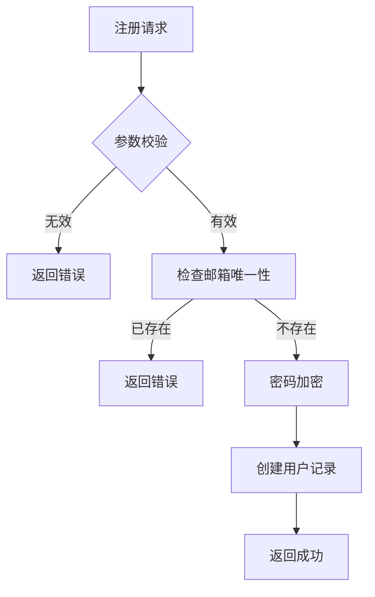
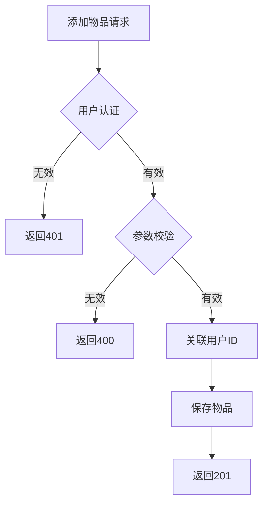
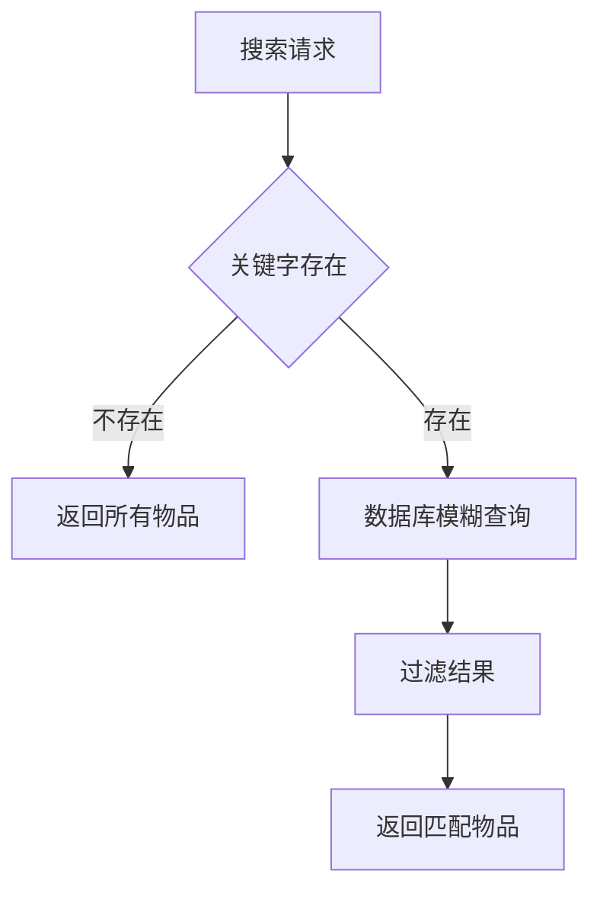
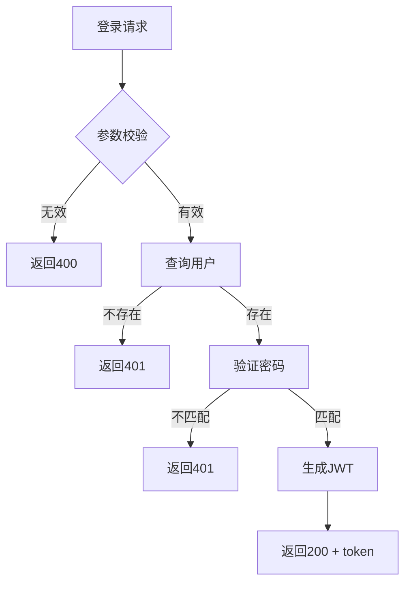

# 业务流程说明

## 用户注册流程

```mermaid
flowchart TD
    A[注册请求] --> B{参数校验}
    B -->|无效| C[返回错误]
    B -->|有效| D[检查邮箱唯一性]
    D -->|已存在| E[返回错误]
    D -->|不存在| F[密码加密]
    F --> G[创建用户记录]
    G --> H[返回成功]
```

## 物品添加流程

```mermaid
flowchart TD
    A[添加物品请求] --> B{用户认证}
    B -->|无效| C[返回401]
    B -->|有效| D{参数校验}
    D -->|无效| E[返回400]
    D -->|有效| F[关联用户ID]
    F --> G[保存物品]
    G --> H[返回201]
```

## 物品搜索流程

```mermaid
flowchart TD
    A[搜索请求] --> B{关键字存在}
    B -->|不存在| C[返回所有物品]
    B -->|存在| D[数据库模糊查询]
    D --> E[过滤结果]
    E --> F[返回匹配物品]
```

## 用户登录流程

```mermaid
flowchart TD
    A[登录请求] --> B{参数校验}
    B -->|无效| C[返回400]
    B -->|有效| D[查询用户]
    D -->|不存在| E[返回401]
    D -->|存在| F[验证密码]
    F -->|不匹配| G[返回401]
    F -->|匹配| H[生成JWT]
    H --> I[返回200 + token]
```

